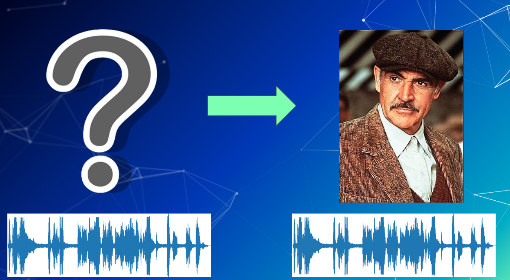
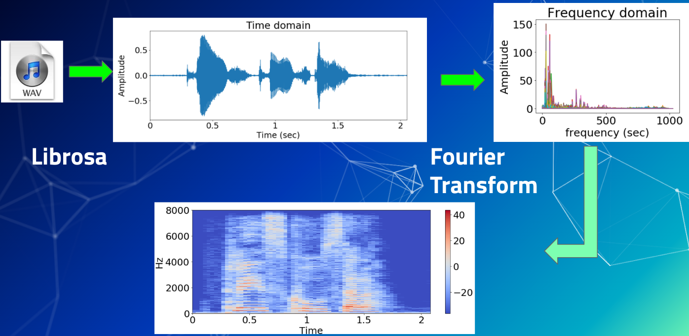
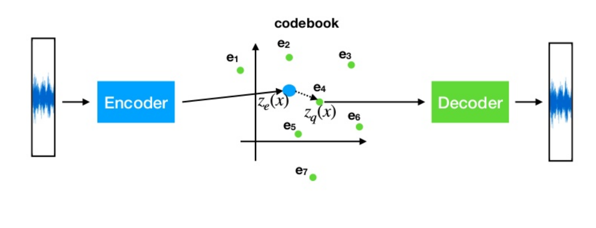

# Speech-to-Speech - Generate synthetic speech
This is a consulting project for Respeecher done as part of Insight Artificial Intelligence Fellowship. 



## Background 
Voice conversion is a widely useful technology which can boost creative possibilities, multiply employment opportunities and benefit people with speech impediments.  Creating high quality speech content is a new and  challenging technology chiefly because of lack of affordable, production quality voice data for developing new speech conversion algorithms. I have developed a speech synthesis pipeline which learns high-level speech descriptors  and extracts speaker representation allowing speaker conversion. This framework aims to obtains high similarity and naturalness to human voice. 


## Installation 

The code is written as a Python 3.6 package. The package can be installed in two ways: (1) by pulling a docker image and runing inference in the container or (2) by cloning the repository and installing the package localy. 

### Running with docker 
Use docker to pull the speech2speech image by using the following command in your terminal:
``` bash
docker pull jabt/speech2speech
```
This command would download the adetector docker image, once its done - create a container and ssh into it:
```bash
docker run --rm -ti jabt/speech2speech bash
```

Now when runing python, the package can be imported and used for inference. 

### Installing locally

For installing locally on your computer, clone the repository. And then use the terminal to install the package:
```bash
cd path/to/cloned/repository
pip install .
```

## Execution 
To setup model training navigate to the repository and run 
```bash
python scripts/setup_training_experiments.py
```
and modify `choices` near the top of the script as needed. 


## Repo directory structure 
The package is located in the `speech2speech` folder. 
```
speech2speech
├── README.md
├── __init__.py
├── _config.yml
├── notebooks
│   ├── Extracting Audio Features.ipynb
│   ├── VQ_VAE.png
│   ├── bayesian-hypothesis-testing-300x225.jpg
│   ├── images
│   │   ├── vq-vae.png
│   │   └── vq-vae.svg
│   ├── model_v1.ipynb
│   ├── model_v2.ipynb
│   ├── model_v3.ipynb
│   ├── model_v4.ipynb
│   ├── output_to_audio.py.ipynb
│   ├── predict-256_spectrogram_db_lr1em4.py.ipynb
│   ├── predict-300_spectrogram_db_lr1em4.py.ipynb
│   ├── predict.py.ipynb
│   └── startup_notes.ipynb
├── scripts
│   ├── run_all_training_experiments_in.sh
│   ├── run_train.sh
│   ├── run_train_num_embeddings256_spectrogram_db_lr1em4.sh
│   ├── run_train_num_embeddings300_spectrogram_db_lr1em3.sh
│   ├── run_train_num_embeddings300_spectrogram_db_lr1em4.sh
│   ├── run_train_num_embeddings500.sh
│   ├── run_train_num_embeddings512_spectrogram_db.sh
│   ├── setup_training_experiments.py
│   └── train_model.py
└── speech2speech
    ├── __init__.py
    ├── data_preprocessing
    │   ├── __init__.py
    │   ├── load_data.py
    │   └── make_spectrograms.py
    ├── models
    │   ├── __init__.py
    │   ├── decoder.py
    │   ├── encoder.py
    │   ├── model.py
    │   ├── residual.py
    │   ├── residual_stack.py
    │   ├── training_utils.py
    │   └── vector_quantizer.py
    └── postprocessing
        └── filter.py
```


## Data 
For training the generating model I have used the VCTK dataset, which has speech recordings of 109 different speakers. 
[VCTK dataset](https://homepages.inf.ed.ac.uk/jyamagis/page3/page58/page58.html). The dataset consists of speech data uttered by 109 speakers of English in varius accents. ach speaker reads out about 400 sentences, most of which were selected from a newspaper plus the Rainbow Passage and an elicitation paragraph intended to identify the speaker's accent. The newspaper texts were taken from The Herald (Glasgow), with permission from Herald & Times Group. Each speaker reads a different set of the newspaper sentences, where each set was selected using a greedy algorithm designed to maximise the contextual and phonetic coverage. The Rainbow Passage and elicitation paragraph are the same for all speakers.

The audio files were converted into magnitude spectrograms using librosa package and used as inputs for the neural network. 



## Algortihm 
The algorithm is based on Vector Quantised Variational Autoencoder (VQ-VAE). The VQ-VAE combines a variational autoencoder (VAE) with a vector quantization (VQ) layer to produce a discrete latent representation which has been shown to capture important high-level features in image, audio and video data, yielding an extremely compact and semantically
meaningful representation of the input. 



It consists of three modules: an encoder,
quantizer/codebook  and a decoder. The encoder reads a sequence of spectrograms and extracts a sequence of hidden vectors which are passed through a bottleneck i.e the quantizer where they become a sequence of latent representations. The decoder then tries to reconstruct the utterances. The waveform samples are reconstructed using Griffin Lim Algorithm. 
I found that the encoder's bottlenek is crucial in extracting non-trivial representations of data. Also note that the encoder is speaker independent and requires only speech data, while the decoder also requires speaker information


